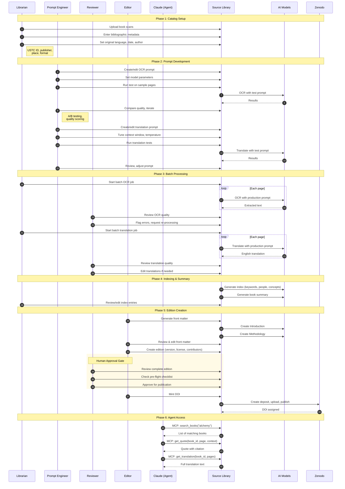
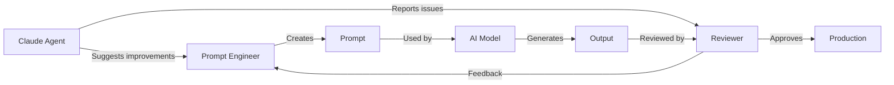

# Source Library: Roles, Workflows & API Design

## User Roles

| Role | Description | Key Activities |
|------|-------------|----------------|
| **Librarian** | Manages catalog and metadata | Upload scans, edit bibliographic data, organize collections |
| **Prompt Engineer** | Optimizes AI output quality | Create/edit OCR prompts, translation prompts, tune parameters |
| **Reviewer** | Quality assurance | Review OCR accuracy, check translations, approve editions |
| **Editor** | Scholarly content | Write introductions, edit front matter, curate editions |
| **Claude (AI Agent)** | Programmatic access | Search texts, retrieve quotes, answer questions about sources |
| **Researcher** | End user | Read translations, cite editions, download EPUBs |

## Extended Workflow Diagram



## Responsibility Matrix

| Activity | Librarian | Prompt Eng | Reviewer | Editor | Claude | AI |
|----------|:---------:|:----------:|:--------:|:------:|:------:|:--:|
| Upload scans | ✓ | | | | | |
| Edit metadata | ✓ | | | | | |
| Create prompts | | ✓ | | | | |
| Tune parameters | | ✓ | | | | |
| Run A/B tests | | ✓ | | | | |
| Execute OCR | | | | | | ✓ |
| Review OCR | | | ✓ | | | |
| Execute translation | | | | | | ✓ |
| Review translation | | | ✓ | | | |
| Edit translations | | | ✓ | ✓ | | |
| Generate front matter | | | | | | ✓ |
| Edit front matter | | | | ✓ | | |
| Approve edition | | | ✓ | ✓ | | |
| Mint DOI | | | | ✓ | | |
| Search library | ✓ | | | | ✓ | |
| Retrieve quotes | | | | | ✓ | |
| Cite sources | | | | | ✓ | |

## MCP Server Design for Claude

### Proposed Tools

```typescript
// Search the library
interface SearchBooksParams {
  query: string;           // Full-text search
  language?: string;       // Filter by original language
  date_range?: [number, number]; // Publication year range
  author?: string;
  has_translation?: boolean;
  has_doi?: boolean;
  limit?: number;
}

// Get a specific quote with citation
interface GetQuoteParams {
  book_id: string;
  page_number: number;
  start_line?: number;     // Optional line range
  end_line?: number;
  include_latin?: boolean; // Include original text
  format?: 'plain' | 'markdown' | 'citation';
}

// Get full translation
interface GetTranslationParams {
  book_id: string;
  pages?: number[];        // Specific pages, or all if omitted
  format?: 'plain' | 'markdown' | 'epub';
}

// Get book metadata
interface GetBookParams {
  book_id: string;
  include_index?: boolean;
  include_summary?: boolean;
}

// Ask a question about a book
interface AskBookParams {
  book_id: string;
  question: string;
  cite_sources?: boolean;  // Include page references
}
```

### Example MCP Responses

**search_books("Drebbel alchemy")**
```json
{
  "results": [
    {
      "id": "6836f8ee811c8ab472a49e36",
      "title": "Tractatus duo. I. De natura elementorum...",
      "display_title": "Two Treatises: On the Nature of Elements",
      "author": "Drebbel, Cornelius",
      "published": "1628",
      "language": "Latin",
      "page_count": 69,
      "has_translation": true,
      "doi": "10.5281/zenodo.18053504",
      "relevance_score": 0.95
    }
  ]
}
```

**get_quote(book_id, page=15)**
```json
{
  "quote": "The fifth essence is that most pure and subtle substance...",
  "original": "Quinta essentia est purissima illa & subtilissima substantia...",
  "page": 15,
  "citation": {
    "text": "Drebbel, Two Treatises (1628), trans. Source Library, p. 15",
    "doi": "10.5281/zenodo.18053504",
    "bibtex": "@misc{drebbel1628, ...}"
  }
}
```

### Skill for Claude Code

A `/source-library` skill could provide:
- Quick search across all translated books
- Quote retrieval with proper citations
- Context about historical texts
- Integration with scholarly writing

```yaml
---
name: source-library
description: Search and retrieve quotes from Source Library's collection of translated historical texts. Use when researching historical topics, finding primary sources, or citing early modern texts.
---

# Source Library Access

Search the collection of translated Latin, German, and other historical texts.

## Commands

- `search [query]` - Find books matching your query
- `quote [book_id] [page]` - Get a quote with citation
- `summary [book_id]` - Get book summary and index
- `cite [book_id]` - Get citation in various formats
```

## API Endpoints Needed

| Endpoint | Method | Purpose |
|----------|--------|---------|
| `/api/search` | GET | Full-text search across books |
| `/api/books/[id]/quote` | GET | Get quote from specific page |
| `/api/books/[id]/ask` | POST | Ask question, get cited answer |
| `/api/mcp` | POST | MCP protocol endpoint |

## Quality Feedback Loop



Claude can participate in quality improvement by:
1. Flagging inconsistent translations
2. Identifying OCR errors in quotes
3. Suggesting prompt improvements based on output patterns
