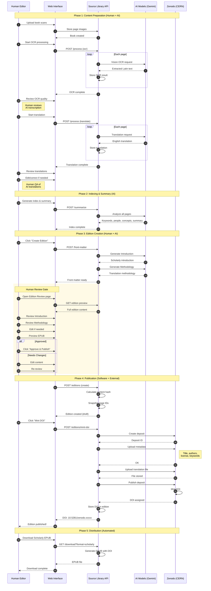

# Scholarly Edition Workflow

## Sequence Diagram

## Responsibility Matrix

| Phase | Step | Who/What | Description |
|-------|------|----------|-------------|
| **Preparation** | Upload | Human | Scan and upload page images |
| | OCR | AI (Gemini Vision) | Extract text from images |
| | OCR Review | Human | Quality check transcription |
| | Translation | AI (Gemini) | Translate to English |
| | Translation Review | Human | Quality check, edit translations |
| **Indexing** | Analysis | AI (Gemini) | Extract keywords, people, concepts |
| | Summary | AI (Gemini) | Generate book summary |
| **Edition** | Front Matter | AI (Gemini) | Generate Introduction & Methodology |
| | Review | **Human** | **Approve content before publication** |
| | Edit | Human | Make corrections if needed |
| | Version | Software | Create edition snapshot, calc hash |
| **Publication** | DOI Request | Software | API call to Zenodo |
| | Metadata | Software | Upload citation metadata |
| | File Upload | Software | Upload translation text |
| | DOI Mint | Zenodo (CERN) | Assign permanent identifier |
| **Distribution** | EPUB | Software | Generate downloadable file |
| | Access | Zenodo | Host permanent record |

## Human Checkpoints

The workflow has **3 critical human review points**:

1. **OCR Quality Review** - After AI transcription, human verifies accuracy
2. **Translation Review** - After AI translation, human checks meaning & style
3. **Edition Approval** - Before DOI minting, human reviews complete package

The **Edition Approval** checkpoint is the final gate before permanent publication. Once a DOI is minted, the content cannot be changed (only new versions can be created).

## Color Legend

| Color | Meaning |
|-------|---------|
| Human Editor | Manual review and decisions |
| Web Interface | User-facing application |
| Source Library API | Backend processing |
| AI Models | Automated content generation |
| Zenodo | External DOI registry |
