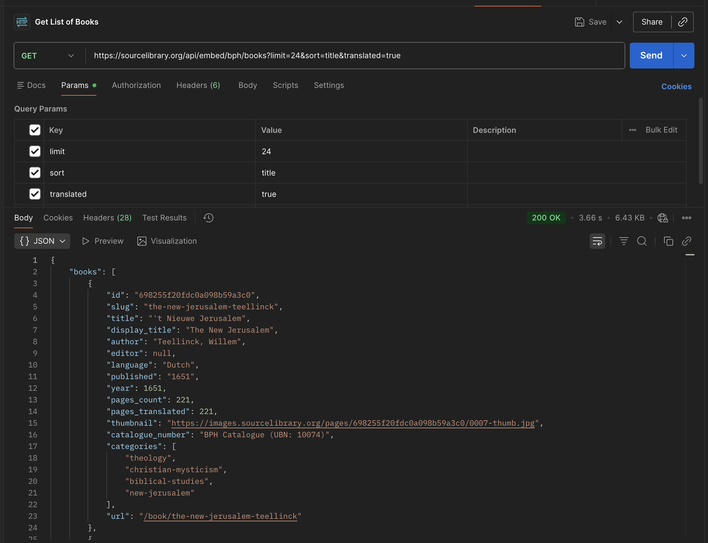

<div align="center">


# Source Library

**A digital library of historical primary sources with AI-aided OCR, translation, and scholarly curation.**

[](https://www.gnu.org/licenses/agpl-3.0)
[](https://nextjs.org)
[](https://www.mongodb.com/cloud/atlas)
[](https://supabase.com)
[](https://ai.google.dev)

[🌐 Visit Library](https://sourcelibrary.org) • [📖 Docs](./docs) • [🗺️ System Map](./.claude/docs/system-map.md) • [🤝 Contribute](#contributing)

</div>

---

## 🎬 Experience Source Library

<div align="center">

<video width="100%" max-width="600" controls poster="https://images.sourcelibrary.org/video/hero-poster.jpg">
  <source src="https://images.sourcelibrary.org/video/hero-bg.webm" type="video/webm">
  <source src="https://images.sourcelibrary.org/video/hero-bg.mp4" type="video/mp4">
  Your browser does not support the video tag.
</video>

*Explore thousands of digitized historical texts with AI-enhanced translations and scholarly curation.*

</div>

---

## 🎯 About Source Library

Source Library is an open digital library dedicated to making early printed books and primary sources readable and citable. We specialize in **alchemy, Hermetica, Kabbalah, Rosicrucianism, and early modern science**—texts that bridge historical scholarship with contemporary exploration.

### 🌟 Why Source Library?

- ✨ **Originals First** — Read the original language text with AI-enhanced translations alongside
- 🎓 **Citable Scholarship** — Every book gets a DOI and scholarly metadata (USTC alignment, edition tracking)
- 🏛️ **Partner Subdomains** — Institutions like the [Bibliotheca Philosophica Hermetica](https://bph.sourcelibrary.org) curate reading rooms on their own domains
- 🔍 **Discovery** — Collections, galleries of illustrations, and semantic search surface overlooked texts
- ✅ **Rigorous QA** — Manual verification, image quality scoring, and OCR validation before publication

The platform ingests **~15K pages monthly** from Internet Archive, Gallica, Bodleian, Wellcome, and other digital heritage partners.

---

## 🚀 Quick Start

### 💻 Development Environment

```bash
# 🍴 Clone and install
git clone https://github.com/Embassy-of-the-Free-Mind/sourcelibrary-v2.git
cd sourcelibrary-v2
npm install

# ⚙️ Configure environment (see .env.example for required variables)
# Must include: MongoDB Atlas connection, Google Gemini API key, Vercel Blob token

# ▶️ Start dev server
npm run dev
```

Open [http://localhost:3000](http://localhost:3000)

---

## 📋 Tech Stack

<table>
<tr>
  <td><strong>🎨 Frontend</strong></td>
  <td>Next.js 16, React 19, TailwindCSS, Lucide icons</td>
</tr>
<tr>
  <td><strong>⚙️ Backend</strong></td>
  <td>Next.js API routes, AWS Lambda for async processing</td>
</tr>
<tr>
  <td><strong>💾 Database</strong></td>
  <td>MongoDB Atlas (primary), Supabase (embeddings)</td>
</tr>
<tr>
  <td><strong>🤖 AI/ML</strong></td>
  <td>Google Gemini 3.1 (OCR, translation, summarization)</td>
</tr>
<tr>
  <td><strong>🗂️ Storage</strong></td>
  <td>Vercel Blob (images), AWS S3 (archive), Cloudflare R2 (archive)</td>
</tr>
<tr>
  <td><strong>🔐 Auth</strong></td>
  <td>NextAuth v5 with MongoDB adapter</td>
</tr>
<tr>
  <td><strong>🚀 DevOps</strong></td>
  <td>Vercel (hosting), GitHub (VCS), Playwright (E2E tests)</td>
</tr>
<tr>
  <td><strong>✔️ Testing</strong></td>
  <td>Vitest (unit/integration), Playwright (E2E)</td>
</tr>
<tr>
  <td><strong>🔎 Search</strong></td>
  <td>PostgreSQL FTS + semantic search via Supabase</td>
</tr>
</table>

**📦 Key Dependencies:**
- `sharp` — Image resizing and cropping
- `@google/generative-ai` — Gemini API integration
- `xml2js` — USTC metadata parsing
- `@modelcontextprotocol/sdk` — MCP server for agent integration
- `stripe` — Donation and subscription handling

---

## 📚 Core Features

### 📖 Reading & Navigation
- **⚡ Page pagination** — Instant navigation between 100+ pages
- **🔍 Full-text search** — Query across OCR'd text and translations
- **📌 Quote generation** — Copy and cite passages with DOI links

### 🔄 Processing Pipeline
- **🧩 Smart split detection** — Automatic gutter detection for two-page spreads (Gemini AI or ML-based)
- **✍️ High-accuracy OCR** — Gemini Vision API with language-specific models (Latin, German, Greek, Arabic, etc.)
- **🗣️ Context-aware translation** — Maintains continuity across pages for scholarly accuracy
- **🖼️ Gallery extraction** — AI-powered detection and cataloging of illustrations

### 🎨 Curation & Discovery
- **📑 Themed collections** — Editorial collections (e.g., "Alchemy & Transmutation," "Kabbalah & Mysticism")
- **🏛️ Gallery browsing** — Curated images from all books (museum-quality metadata)
- **📚 Related editions** — Link across translations, reprints, and derivative works
- **🔗 Authority linking** — Connect to USTC, VIAF, and other scholarly databases

### 📤 Scholarly Export
- **📱 EPUB generation** — Multi-format ebook export
- **📄 PDF with annotations** — Preserve layout, add scholarly notes
- **🆔 DOI minting** — Version books via Zenodo integration for long-term citation

### 🏢 Tenant Subdomains
- **🏛️ Isolated reading rooms** — Partners host curated subsets on custom domains (e.g., `bph.sourcelibrary.org`)
- **🎨 Branding & navigation** — Full UI customization per tenant
- **🔒 Access control** — Public or members-only collections

---

## 🏗️ Architecture Overview

### 📊 Data Model

**📚 Books** contain structured metadata:
- **🏛️ Bibliographic** — Title, author, language, publication date, USTC ID
- **🖼️ Images** — Links to source (Internet Archive, Gallica, etc.), archival status
- **⚙️ Processing** — OCR status, translation language, extraction metadata
- **🎨 Curation** — Collections, tier (featured/standard), visibility flags

**📄 Pages** store individual page data:
- **📸 Original image** — Source photo or PDF page
- **✂️ Split coordinates** — Crop boundaries (0-1000 scale) for two-page spreads
- **✍️ OCR output** — Raw Gemini extraction + language metadata
- **🗣️ Translation** — English translation with scholarly notes
- **🖼️ Illustrations** — Detected images with quality scores and descriptions

**🖼️ Gallery images** are extracted illustrations:
- **🏷️ Metadata** — Subject, figures, symbols, style, techniques, period
- **⭐ Quality score** — 0–1.0 rating (filters below 0.5)
- **🔗 Provenance** — Source book and page, linked back

### 🎨 Image Tier System

All page images are resized on-demand via ``/api/image``:

| Tier | Dimensions | Quality | 📱 Use Case |
|------|-----------|---------|----------|
| **Thumbnail** | 400px wide | 70% JPEG | Grids, navigation, social sharing |
| **Display** | 1200px wide | 80% JPEG | Main reading view, comfortable for annotation |
| **Full** | 2400px wide | 90% JPEG | Magnifier, fullscreen detail, printing |

Split pages are cropped non-destructively via coordinates; original images are always preserved.

### 🔄 Processing Pipeline

```
📥 Import → ✂️ Split Detection → ✍️ OCR → 🗣️ Translation → 🎨 Enrichment → 🌍 Publishing
```

1. **📥 Import** — Upload images, import from IA/Gallica via IIIF, or paste URLs
2. **✂️ Split Detection** — Detect two-page spreads; mark crop boundaries
3. **✍️ OCR** — Gemini Vision extracts text per page language
4. **🗣️ Translation** — Gemini translates to English with prior-page context for continuity
5. **🎨 Enrichment** — Extract illustrations, generate summaries, assign collections
6. **🌍 Publishing** — Set `visible: true`, mint DOI, push to search index

Batch endpoints process up to 5 pages/request using Gemini Batch API (50% cheaper).

### 🔌 API Routes (Key)

**Base URL:** `https://sourcelibrary.org` (production) or `http://localhost:3000` (local dev with `.env.local` configured).

> **Common 404 mistake:** paths like `/api/bph/books` or `/api/bph/books/[id]` **do not exist**. BPH catalogue APIs live under `/api/embed/bph/...`. There is also **no** top-level `/api/[tenant]/books` route — tenant book listings use `/api/books/library` or the embed routes below.

#### Public read APIs (no auth required today)

| Endpoint | Method | Purpose |
|----------|--------|---------|
| `/api/search?q=<query>` | GET | Full-text search across books and page translations |
| `/api/books?limit=100&offset=0` | GET | Simple book list (global catalogue; `visible: true`, indexed only) |
| `/api/books/library?limit=100&skip=0` | GET | Rich browse API — search, sort, filters, collections |
| `/api/books/[id]` | GET | Book metadata (accepts Mongo `id` or `slug`) |
| `/api/books/[id]/quote?page=<n>` | GET | Citable quote + formatted citations (inline, footnote, BibTeX, DOI) |
| `/api/gallery?limit=24` | GET | Illustration / artwork search |
| `/api/image?url=<encoded-url>&w=400` | GET | On-demand image resize & crop |
| `/api/embed/bph/books?limit=24` | GET | BPH catalogue (paginated, searchable) |
| `/api/embed/bph/books/[slug]` | GET | Single BPH book detail |
| `/api/embed/bph/featured` | GET | Featured BPH books |
| `/api/embed/bph/collections` | GET | BPH collection list |
| `/api/embed/bph/languages` | GET | BPH language facets |
| `/api/embed/bph/suggest?q=alch` | GET | BPH search autocomplete |
| `/api/embed/bph/stats` | GET | BPH catalogue stats |

#### Tenant-scoped listing (not `/api/bph/...`)

Use one of these patterns to filter by partner tenant (e.g. BPH):

| Approach | Example |
|----------|---------|
| **Embed prefix (recommended for BPH)** | `GET /api/embed/bph/books?limit=24` |
| **Library API + query param** | `GET /api/books/library?tenant_slug=bph&limit=24` |
| **Host header (subdomain)** | Call `https://bph.sourcelibrary.org/api/books/library?limit=24` — the proxy injects tenant context |
| **Manual header (advanced)** | `curl -H "x-tenant-slug: bph" https://sourcelibrary.org/api/books/library?limit=24` |

The `/api/[tenant]/books/[id]/...` paths that exist in the codebase are **editor/processing** routes (batch OCR, index rebuild, etc.) — not public catalogue listings.

#### Authenticated / internal APIs

These require a signed-in session cookie, editor role, or (for some dataset endpoints) a Bearer API key. Calling them without auth returns `401` or `403`.

| Endpoint | Method | Purpose |
|----------|--------|---------|
| `/api/books` | POST | Create a new book (editor) |
| `/api/books/[id]` | PATCH | Update book metadata (curator+) |
| `/api/books/[id]/batch-ocr-async` | POST | Queue batch OCR job |
| `/api/books/[id]/batch-translate-async` | POST | Queue batch translation job |
| `/api/pages/[id]` | PATCH | Update page OCR/translation |
| `/api/jobs/[id]/process` | POST | Async job processor (Lambda) |

Full narrative API walkthrough: [`docs/blog-source-library-api.md`](./docs/blog-source-library-api.md). MCP tools (search, quote, read): [`mcp-server/README.md`](./mcp-server/README.md).

### 🧪 Trying the API (curl, Postman, browser)

All examples below hit **production** and need no API key. Replace the base URL with `http://localhost:3000` when running locally (MongoDB + env vars required).

#### curl

```bash
# Search translated text
curl -s "https://sourcelibrary.org/api/search?q=quintessence&limit=5" | jq .

# List books (global catalogue)
curl -s "https://sourcelibrary.org/api/books?limit=5" | jq .

# Browse with filters and sort
curl -s "https://sourcelibrary.org/api/books/library?limit=5&sort=recent-translation&has_translation=true" | jq .

# BPH catalogue — note /api/embed/bph/, NOT /api/bph/
curl -s "https://sourcelibrary.org/api/embed/bph/books?limit=5&translated=true" | jq .

# BPH via tenant_slug on the library endpoint
curl -s "https://sourcelibrary.org/api/books/library?tenant_slug=bph&limit=5" | jq .

# Book metadata (id or slug)
curl -s "https://sourcelibrary.org/api/books/know-thyself-reger-von-ehrenhart" | jq .

# Citable quote for a page
curl -s "https://sourcelibrary.org/api/books/6836f8ee811c8ab472a49e36/quote?page=57" | jq .

# Gallery search
curl -s "https://sourcelibrary.org/api/gallery?subject=alchemy&limit=5" | jq .
```

Pretty-printing with `jq` is optional; omit `| jq .` to see raw JSON.

#### Postman

1. Create a new **GET** request.
2. Set URL to e.g. `https://sourcelibrary.org/api/embed/bph/books`
3. On the **Params** tab add query keys: `limit` = `24`, `sort` = `title`, `translated` = `true`
4. Leave **Auth** as *No Auth* for the public endpoints above.
5. Send — expect `200` with JSON body.



#### Browser

Public GET endpoints can be opened directly:

- [Search: quintessence](https://sourcelibrary.org/api/search?q=quintessence&limit=5)
- [BPH books](https://sourcelibrary.org/api/embed/bph/books?limit=5)
- [Global library browse](https://sourcelibrary.org/api/books/library?limit=5)

### 📁 Directory Structure

```
src/
├── app/                         # 🎨 Next.js App Router
│   ├── book/[id]/               # 📖 Book detail, reading, processing
│   │   ├── page.tsx             # Main book hub
│   │   ├── split/page.tsx       # Split detection workflow
│   │   └── page/[pageId]/page.tsx      # Individual page view
│   ├── api/                     # 🔌 All API routes
│   │   ├── books/               # Book CRUD & batch ops
│   │   ├── pages/               # Page processing
│   │   ├── image/               # Image proxy & cropping
│   │   ├── jobs/                # Async job tracking
│   │   └── search/              # Full-text & semantic
│   ├── [tenant]/                # 🏢 Tenant subdomain routes
│   ├── gallery/                 # 🖼️ Illustration browsing
│   ├── collections/             # 📑 Collection pages
│   └── admin/                   # ⚙️ Admin dashboard
├── hooks/                       # 🎣 Reusable React hooks
└── lib/                         # 🛠️ Business logic & utilities
    ├── mongodb.ts               # Database operations
    ├── image-extraction.ts      # Illustration detection
    └── auth-helpers.ts          # Authentication utilities

scripts/
├── workers/                     # ⚙️ Lambda worker functions
│   ├── pipeline-orchestrator.mjs # Main processing pipeline
│   ├── image-extract-worker.mjs # Gallery extraction
│   └── ...
├── maintenance/                 # 🔧 One-off maintenance scripts
├── migrations/                  # 📊 Database schema updates
└── audit-bph-leaks.mjs          # 🔒 Tenant security verification

tests/
├── unit/                        # ✔️ Vitest unit tests
└── integration/                 # 🔗 Integration tests

prompts/                        # 🤖 AI system prompts
├── ocr/
├── translation/
├── split-detection/
└── ...

.claude/                        # 🧠 AI agent context
├── docs/                       # 📚 Detailed architecture docs
├── skills/                     # 🎯 Specialized agent skills
└── handoffs/                   # 📋 Incident reports & lessons
```

---

## 🔄 Common Workflows

### 📥 Importing Books from Internet Archive

```typescript
// From the UI or via API
POST /api/books
{
  "ia_id": "thehermetic00fludd",
  "title": "The Hermetic and Alchemical Writings",
  "author": "Arthur Edward Waite",
  "language": "en",
  "ustc_id": "123456"
}
```

The system:
1. 📥 Fetches page images from IA IIIF
2. ✂️ Detects splits and generates crop coordinates
3. 📤 Queues for OCR and translation
4. 🌍 Publishes when processing completes

### ✂️ Processing a Split Book

1. 🖥️ Visit `/book/[id]/split`
2. 🖱️ Adjust split line visually (drag or Gemini AI auto-detection)
3. ✅ Click "Apply Split" — creates two virtual pages with crop coordinates
4. 📸 Original images preserved; OCR runs on cropped versions

### ✍️ Batch OCR with Gemini Batch API

```typescript
POST /api/books/[id]/batch-ocr-async
{
  "page_ids": ["page-1", "page-2", "page-3"],
  "language": "la"
}
```

Returns a job ID; Gemini processes offline, saves results when complete. 50% cheaper than standard API.

### 🎓 Generating a Scholarly Edition

```typescript
POST /api/books/[id]/editions
{
  "title": "The Emerald Tablet: First Complete English Translation",
  "translator": "Jane Doe",
  "language": "en",
  "format": "epub"
}
```

System generates:
- 📝 Scholarly front matter (introduction, translator bio, etc.)
- 📱 EPUB with TOC and metadata
- 🆔 DOI via Zenodo integration
- 📚 Citation metadata (BibTeX, RIS)

---

## 🧪 Testing

### 🚀 Run Tests

```bash
# Unit tests
npm run test:unit

# Integration tests
npm run test:integration

# End-to-end tests (Playwright)
npm run test:e2e

# Coverage report
npm run test:coverage

# Watch mode
npm run test:watch
```

### ✅ E2E Test Examples

- 📥 **Book import** — Validate IA ingestion pipeline
- ✂️ **Split detection** — Verify gutter detection accuracy
- 🌐 **Translation** — Confirm source/translation alignment
- 🔒 **Tenant subdomain** — Ensure content isolation (no leaks)
- 🔍 **Search** — Test full-text and semantic indexing

---

## 🚀 Deployment

### 🔄 Staging (Preview)

Every pushed branch auto-deploys to Vercel preview:

```bash
git push origin feat/my-feature
# ↓ Vercel builds and deploys
# ↓ Preview URL in GitHub PR
```

### 🌍 Production

Merge to `main` via PR → automatic Vercel deploy to [sourcelibrary.org](https://sourcelibrary.org)

**✅ Pre-deployment checklist:**
- [ ] Tests pass (`npm run test`)
- [ ] TypeScript check passes (`npx tsc --noEmit`)
- [ ] No hardcoded secrets or credentials
- [ ] Tenant subdomain leak audit passes (`node scripts/audit-bph-leaks.mjs`)
- [ ] PR reviewed and approved

### 🔑 Environment Variables

**Required** (`.env.local`):
```
MONGODB_URI=mongodb+srv://...
NEXTAUTH_SECRET=<random-secret>
GOOGLE_API_KEY=<gemini-key>
VERCEL_BLOB_TOKEN=<vercel-blob-token>
AWS_REGION=us-east-1
AWS_ACCESS_KEY_ID=...
AWS_SECRET_ACCESS_KEY=...
```

**Optional:**
```
STRIPE_SECRET_KEY=<for-donations>
ZENODO_TOKEN=<for-doi-minting>
SUPABASE_URL=<for-embeddings>
```

---

## 📖 Documentation

- 🗺️ **[System Map](./.claude/docs/system-map.md)** — Comprehensive architecture diagram and file index
- 🏗️ **[ARCHITECTURE.md](./ARCHITECTURE.md)** — Data model, workflows, and design decisions
- 🤖 **[AGENTS.md](./AGENTS.md)** — Technical context for AI agents and automated workers
- 📋 **[CLAUDE.md](./CLAUDE.md)** — Development workflow, PR conventions, critical invariants
- 🔐 **[AUTH_IMPLEMENTATION.md](./AUTH_IMPLEMENTATION.md)** — NextAuth setup and tenant auth
- 📦 **[Batch OCR Workflow](./docs/BATCH-OCR-WORKFLOW.md)** — Using Gemini Batch API
- 🔌 **[API Documentation](./docs/blog-source-library-api.md)** — REST API reference
- 🖼️ **[Image Processing](./AGENTS.md#image-processing)** — How cropping and resizing works

---

## 🤝 Contributing

We welcome contributions! **Start with [CONTRIBUTING.md](./CONTRIBUTING.md)** — setup, the branch/PR workflow, how deploys work (and the Vercel setup you should NOT do), and the data-safety rules. Deeper doctrine lives in the [development workflow](./CLAUDE.md#development-workflow). The short version:

1. **🌿 Create a feature branch** (off `main`):
   ```bash
   # Using git worktree for multi-session safety
   git worktree add .claude/worktrees/feat-xyz feat/xyz
   cd .claude/worktrees/feat-xyz
   ```

2. **✏️ Make changes and test**:
   ```bash
   npm run lint
   npm run test
   npm run test:e2e
   ```

3. **📤 Push and create a PR**:
   ```bash
   git push origin feat/xyz
   gh pr create --base main
   ```

4. **📋 PR guidelines**:
   - **One concern per PR** — Don't bundle refactors with features
   - **Verify deletions** — Always `grep -rn` before deleting code
   - **Run type check** — `npx tsc --noEmit` before submitting
   - **Describe scope** — State what's in scope AND out of scope

### 🎯 What We're Looking For

- 🐛 **Bug fixes** with test coverage
- ✨ **Feature implementations** aligned with project mission
- ⚡ **Performance improvements** with benchmarks
- 📝 **Documentation** improvements
- ♿ **UX/accessibility** enhancements
- 🏢 **Tenant integration** examples

### 📢 Reporting Issues

- 🐛 **Bugs** — Include reproduction steps, expected vs. actual behavior
- 💡 **Feature requests** — Explain the use case and user impact
- ❓ **Questions** — [Open an issue](https://github.com/Embassy-of-the-Free-Mind/sourcelibrary-v2/issues)

---

## 🛡️ Security & Data Protection

- 🚫 **No deletion without approval** — All book/page deletions require explicit confirmation
- 🔒 **Tenant isolation** — Tenant subdomains are closed systems (no cross-tenant leaks)
- 🔐 **Secret management** — All secrets via environment variables, never hardcoded
- ⚖️ **AGPL licensing** — Contributions must respect AGPL-3.0-or-later

See [CLAUDE.md Security](./CLAUDE.md#security---critical) for detailed security policies.

---

## 📊 Current Status

_As of July 2026 — these move weekly; live numbers at [sourcelibrary.org/data](https://sourcelibrary.org/data)._

**📈 Active Corpus:**
- 📚 ~29K books with `visible: true`
- ✅ ~15K fully processed (OCR'd and translated)
- 🌍 ~14K with full English translations
- 🖼️ 200K+ catalogued illustrations in the [gallery](https://sourcelibrary.org/gallery)

**⚙️ Processing Capacity:**
- 📥 15K+ pages/month ingestion
- 🗣️ Multi-language support (Latin, German, Greek, Arabic, Sanskrit, Chinese, etc.)
- 💰 Batch API for 50% cost reduction

**🏢 Platform Tenants:**
- 🔮 [Bibliotheca Philosophica Hermetica](https://bph.sourcelibrary.org) — Hermetica & esoterica
- ⚗️ [Kloss Collection](https://kloss-collection.sourcelibrary.org) — Medical alchemy
- 🤝 Additional partners in development

---

## 📝 License

Source Library is licensed under the **GNU Affero General Public License v3.0 or later** ([AGPL-3.0-or-later](./LICENSE)). All contributions must respect this license.

See [LICENSING.md](./LICENSING.md) for details on third-party licenses and attribution.

---

## 📞 Support & Community
- 🐛 **Found a bug?** [Open an issue](https://github.com/Embassy-of-the-Free-Mind/sourcelibrary-v2/issues)
- 🤝 **Want to collaborate?** [Contribute](https://sourcelibrary.org/contribute)
- 🌐 **Visit the site** — [sourcelibrary.org](https://sourcelibrary.org)

---

<div align="center">

**📖 Digitizing history. Making primary sources readable. Building open scholarship.**

[↑ Back to top](#-source-library)

</div>

```
src/
├── app/              # All routes, pages, and API endpoints
│   ├── api/          # API routes
│   ├── book/         # Book pages (detail, read, pipeline)
│   └── page.tsx      # Homepage
├── components/       # Reusable React components
├── hooks/            # Reusable React hooks for component logic
└── lib/              # Business Logic, Utilities (mongodb, ai, types), and Services
```
